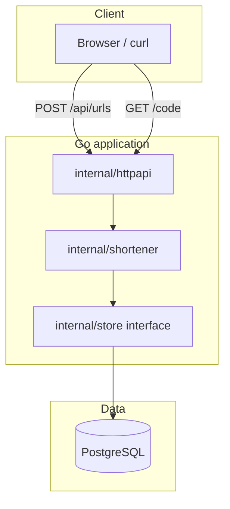

# URL Shortener

A containerized URL shortener API built in Go. It accepts long URLs, stores them in PostgreSQL under a short random code, and redirects clients to the original destination. The project is structured as a small, production-style service: layered packages, environment-based configuration, persistent storage, and Docker Compose for a one-command local stack.

## Features

- Create short links via a JSON REST endpoint
- Redirect short codes to the original URL (`302 Found`)
- Cryptographically random short codes with collision retry
- URL validation (HTTP/HTTPS only)
- PostgreSQL persistence
- Health check endpoint for orchestration and monitoring
- Interactive API docs via Swagger UI (`/swagger/index.html`)
- Multi-stage Docker image (minimal distroless runtime)
- Docker Compose stack (app + database) with automatic schema init

## Tech stack

| Layer      | Technology                                                                                                                                          |
| ---------- | --------------------------------------------------------------------------------------------------------------------------------------------------- |
| Language   | [Go](https://go.dev/) 1.25                                                                                                                          |
| HTTP       | Standard library `net/http` (`ServeMux`, Go 1.22+ route patterns)                                                                                   |
| API docs   | [Swagger / OpenAPI](https://swagger.io/) via [swaggo/swag](https://github.com/swaggo/swag) + [http-swagger](https://github.com/swaggo/http-swagger) |
| Database   | [PostgreSQL](https://www.postgresql.org/) 16                                                                                                        |
| Containers | [Docker](https://www.docker.com/) multi-stage build                                                                                                 |

No web framework, ORM, or router library — intentional simplicity and minimal dependencies.

## How it works

### Architecture

The codebase follows a thin layered layout: HTTP handlers delegate to domain logic, which talks to a storage interface. PostgreSQL is the only implementation of that interface.



### Creating a short link

1. Client sends `POST /api/urls` with `{"url":"https://..."}`.
2. The **shortener** service validates the URL (scheme must be `http` or `https`, host required).
3. A **7-character** code is generated from `crypto/rand` (alphanumeric, base62-style charset).
4. The mapping is inserted into the `urls` table. If the code already exists (unique constraint), generation retries up to 5 times.
5. The API responds with `201` and JSON containing `code` and `short_url` (built from `BASE_URL` + `/` + code).

### Resolving a short link

1. Client requests `GET /{code}` (e.g. `GET /aBc12Xy`).
2. The service looks up `code` in PostgreSQL.
3. On success, the server responds with **`302 Found`** and a `Location` header pointing at the stored long URL.
4. On unknown code, the client receives **`404`** with a JSON error body.

### Database schema

Defined in [`migrations/001_init.sql`](migrations/001_init.sql) and applied automatically on first Postgres startup in Docker (mounted into `/docker-entrypoint-initdb.d/`).

| Column       | Type          | Description                        |
| ------------ | ------------- | ---------------------------------- |
| `code`       | `TEXT` (PK)   | Short identifier                   |
| `long_url`   | `TEXT`        | Original URL                       |
| `created_at` | `TIMESTAMPTZ` | Insert timestamp (default `now()`) |

### Docker deployment

Compose runs two services:

- **`db`** — Postgres 16 with a named volume, healthcheck (`pg_isready`), and init SQL mount.
- **`app`** — Built from the repo `Dockerfile`; waits until `db` is healthy, then starts with `DATABASE_URL` pointing at the `db` hostname on the Compose network.

## API documentation (Swagger)

With the server running, open the interactive Swagger UI:

**http://localhost:8080/swagger/index.html**

The OpenAPI spec is generated from handler annotations ([swaggo/swag](https://github.com/swaggo/swag)) and served at `/swagger/doc.json`. You can try endpoints directly from the UI (e.g. **POST /api/urls** with a JSON body).

## Quick start (Docker)

**Prerequisites:** Docker Desktop (or Docker Engine + Compose v2)

```bash
docker compose up --build
```

Create a short link (bash / Git Bash):

```bash
curl -X POST http://localhost:8080/api/urls -H "Content-Type: application/json" -d '{"url":"https://example.com"}'
```

PowerShell (use `curl.exe` — `curl` is often an alias; use single-quoted JSON):

```powershell
curl.exe -X POST http://localhost:8080/api/urls -H "Content-Type: application/json" -d '{"url":"https://example.com"}'
```

Follow the redirect (replace `CODE` with the value from the response):

```bash
curl -I http://localhost:8080/CODE
```

```powershell
curl.exe -I http://localhost:8080/CODE
```

Health check:

```bash
curl http://localhost:8080/health
```

Stop the stack:

```bash
docker compose down
```

Reset the database (drops the volume; init SQL runs again on next `up`):

```bash
docker compose down -v
```

## Local development (without Docker)

1. Install Go 1.25+ and PostgreSQL 16+.
2. Create a database and apply the schema:

   ```bash
   psql -U postgres -c "CREATE DATABASE shortener;"
   psql -U postgres -d shortener -f migrations/001_init.sql
   ```

3. Export variables from `.env.example` (or use a `.env` file with your shell/tooling).
4. Run the server:

   ```bash
   go run ./cmd/server
   ```

## Testing

Tests live in [`tests/`](tests/) as an external package (`shortener_test`) so they exercise the public API rather than internal helpers.

```bash
go test ./...
```

Coverage includes URL validation (via `Create`), successful short-link creation with a mock store, and expected short-code length.

## Design notes

- **Store interface** — Handlers and domain logic depend on `store.Store`, not SQL, which keeps persistence swappable and tests simple (mock store in `tests/`).
- **No custom slugs** — Codes are always random; avoids validation complexity and enumeration concerns for a portfolio baseline.
- **Stdlib HTTP only** — Route patterns like `POST /api/urls` and `GET /{code}` on `ServeMux` avoid pulling in chi/gin for three endpoints.
- **Postgres init via Compose** — No migration runner in the app; schema ships with the repo and runs once when the DB volume is first created.
